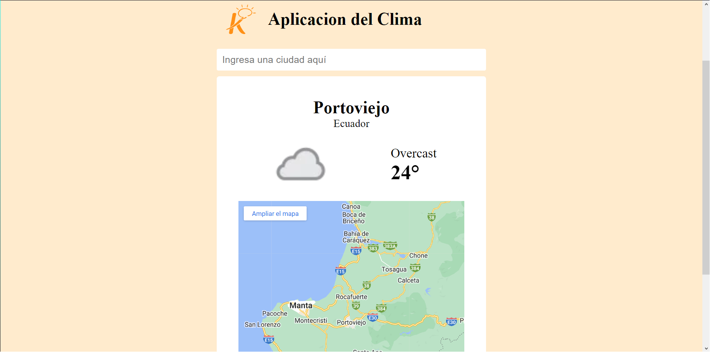

# Kruger Start Reporte de Clima

 > Este es un proyecto que sirve para ver el reporte del clima ingresando el nombre de una ciudad.

## Build with 

 - JS
 - React
 - Netlify
 - HTML CSS
 - WeatherApi

## Live Demo

 [Live Demo Link](https://enchanting-speculoos-f496fc.netlify.app)

## Run it Locally

 ### Setup
 
  -Clone this repo using `git clone https://github.com/Alex-Junior-Solorzano/Clima`

 ### Comands
  - 'npm i'
  - 'npm start'

## Autor

 👤 **Alex Junior Solorzano**

 - GitHub: [@Alex-Junior-Solorzano](https://github.com/Alex-Junior-Solorzano)

## Acknowledgments

 - [@vidamrr](https://www.youtube.com/@vidamrr)
